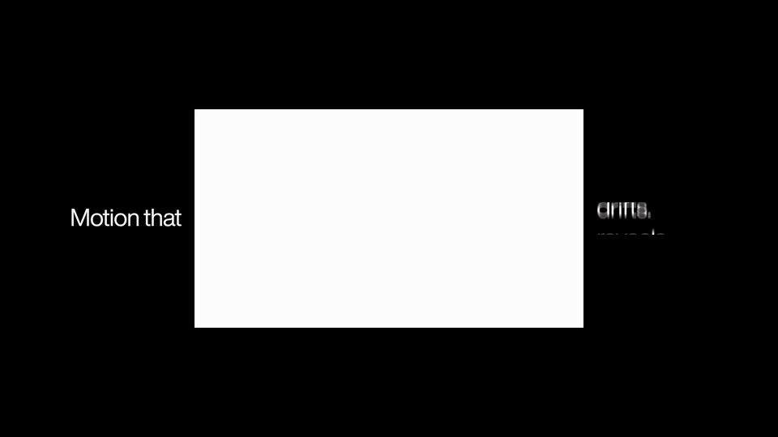
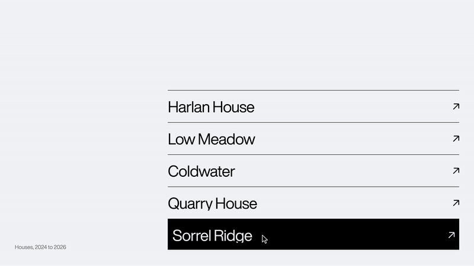
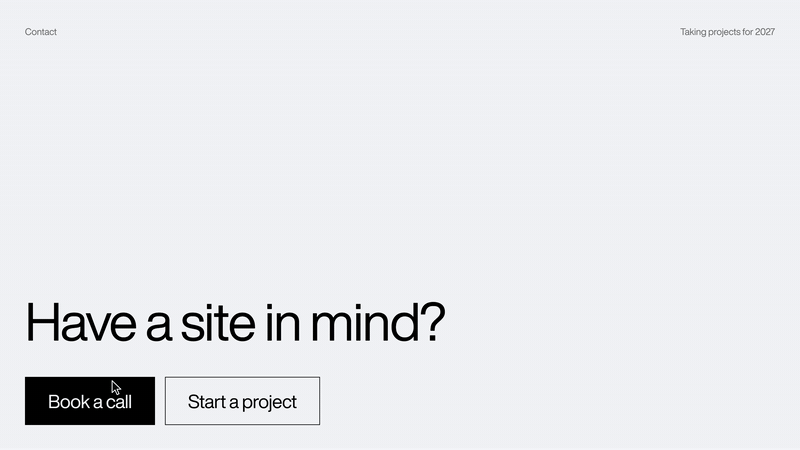
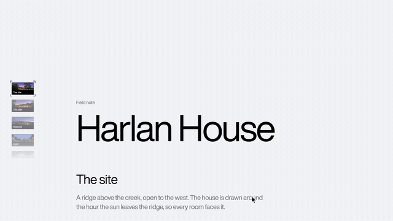
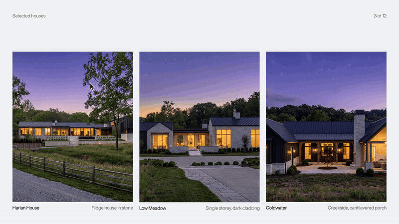
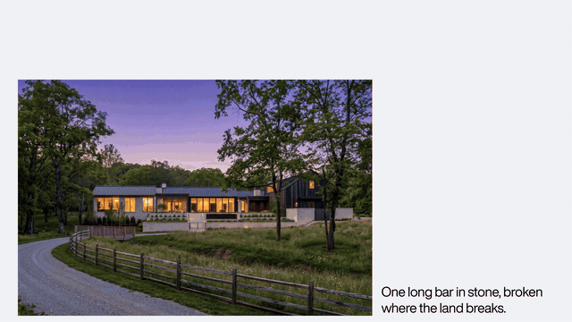
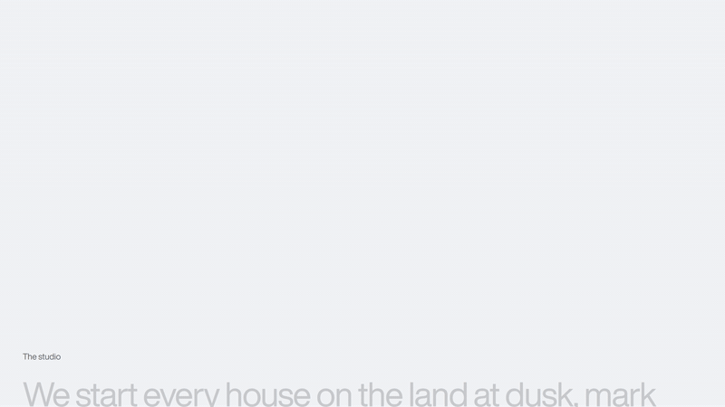
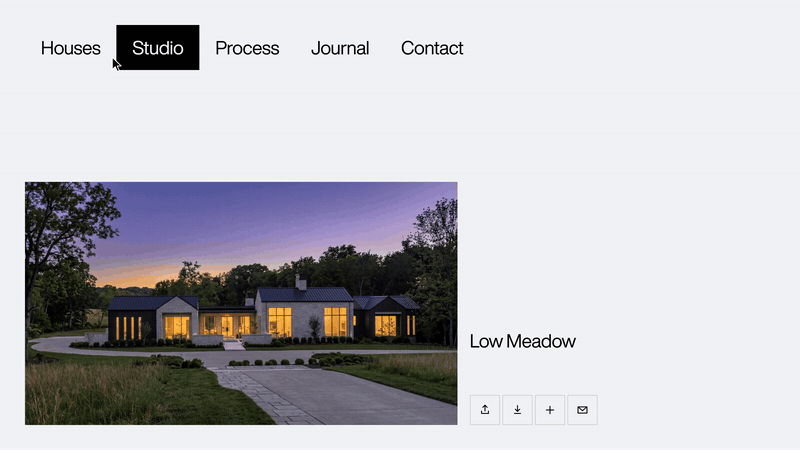
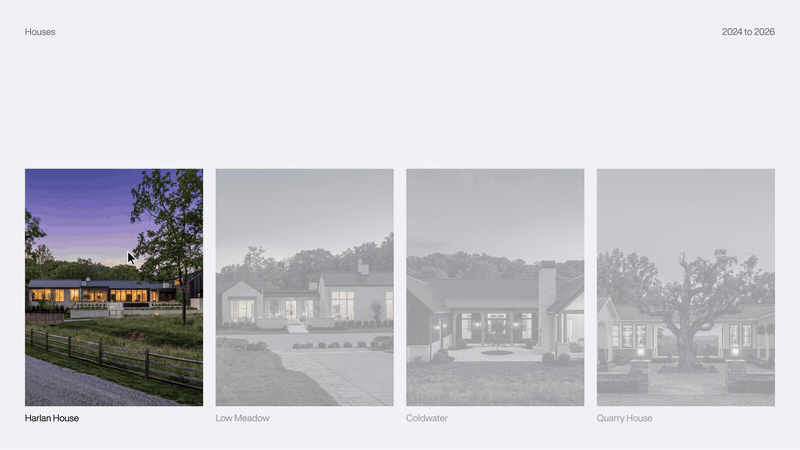
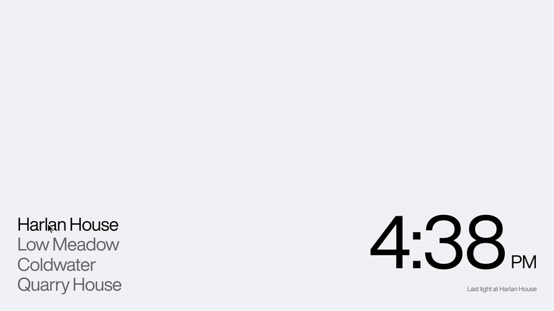

# Animation library

Twelve motion skills for [Claude Code](https://claude.com/claude-code). Each one builds a single animation into a Next.js project in one pass: it reads your project first, writes the component where your project keeps components, uses it where you ask, and then runs its own checks.

They're the motion details I reach for on studio sites. None of them is a template. Each is a small primitive that fits many places, and each was applied word for word to three fresh projects and tested in dev and production, in Chromium, Firefox and WebKit, before it was published.

## The skills

<table>
<tr>
<td width="50%" valign="top">
<a href="components/split-text-line-reveal"></a>
<br><b><a href="components/split-text-line-reveal">Split text line reveal</a></b>
<br>Each line of a heading rises out of its own mask, staggered, then hands the text back to React.
</td>
<td width="50%" valign="top">
<a href="components/list-hover-sliding-fill"></a>
<br><b><a href="components/list-hover-sliding-fill">List hover sliding fill</a></b>
<br>A link list whose hover fill slides from row to row like one bar.
</td>
</tr>
<tr>
<td width="50%" valign="top">
<a href="components/roll-link-hover"></a>
<br><b><a href="components/roll-link-hover">Roll link hover</a></b>
<br>Letters roll up one line in a 15 ms wave, a dimmer copy rising behind.
</td>
<td width="50%" valign="top">
<a href="components/wipe-button"></a>
<br><b><a href="components/wipe-button">Wipe button</a></b>
<br>The fill only travels one way: out the top on hover, back in from the bottom.
</td>
</tr>
<tr>
<td width="50%" valign="top">
<a href="components/note-minimap"></a>
<br><b><a href="components/note-minimap">Note minimap</a></b>
<br>A rail of section cards that follows your reading on a soft spring.
</td>
<td width="50%" valign="top">
<a href="components/cursor-label"></a>
<br><b><a href="components/cursor-label">Cursor label</a></b>
<br>A word like (View) rolls in at the cursor and trails it a step behind.
</td>
</tr>
<tr>
<td width="50%" valign="top">
<a href="components/parallax-image"></a>
<br><b><a href="components/parallax-image">Parallax image</a></b>
<br>A picture moves inside a still frame: drift, zoom or settle.
</td>
<td width="50%" valign="top">
<a href="components/scroll-color-fill"></a>
<br><b><a href="components/scroll-color-fill">Scroll color fill</a></b>
<br>A statement fills from grey to ink, character by character, as you scroll.
</td>
</tr>
<tr>
<td width="50%" valign="top">
<a href="components/travelling-indicator"></a>
<br><b><a href="components/travelling-indicator">Travelling indicator</a></b>
<br>One highlight travels between items and resizes to each.
</td>
<td width="50%" valign="top">
<a href="components/focus-dim"></a>
<br><b><a href="components/focus-dim">Focus dim</a></b>
<br>Point at one item and its siblings step back. CSS only.
</td>
</tr>
<tr>
<td width="50%" valign="top">
<a href="components/number-roll"></a>
<br><b><a href="components/number-roll">Number roll</a></b>
<br>Digits roll to a new value, right-most first; symbols stay put.
</td>
<td width="50%" valign="top">
<a href="components/hover-play"></a>
<br><b><a href="components/hover-play">Hover play</a></b>
<br>A video card plays on hover and holds its frame when you leave.
</td>
</tr>
</table>

Every one works with the App Router or the Pages Router, with or without Tailwind, and respects `prefers-reduced-motion`. Click a preview for its files and notes.

## Install

```bash
git clone https://github.com/lscottart/animation-library.git
mkdir -p ~/.claude/commands/animations
cp animation-library/skills/*.md ~/.claude/commands/animations/
```

To keep them in one project, copy them into that project's `.claude/commands/animations/` instead. Then, inside a Next.js project, run one and say where it goes:

```
/animations:split-text-line-reveal the hero heading on app/page.tsx
/animations:focus-dim the project grid on the home page
/animations:number-roll the local time in the footer
```

With no instructions, each skill builds a small demo of itself. The skills were tuned on Claude Opus 5.5 at maximum effort and their frontmatter asks for it (`model: claude-opus-5-5`, `effort: max`); edit those two lines to run them on something else.

Not using Claude Code? [`components/`](components/) has the source of every animation, the same code the skills write, with a note in each folder on where the files go.

## How they're tested

A skill ships only when its code, applied verbatim to projects nobody prepared for it, passes every cell of this matrix:

| | Chromium 153 | Firefox 155 | WebKit 26.6 |
|---|---|---|---|
| App Router + Tailwind v4 | dev, production | dev, production | dev, production |
| App Router + Tailwind v3 | dev, production | dev, production | dev, production |
| Pages Router + `src/`, no Tailwind | dev, production | dev, production | dev, production |

Next.js 16.3.8, React 19.2.8, GSAP 3.15, Playwright 1.63. In each cell: a type check, lint, a production build, and the skill's own suite, which measures the motion frame by frame (where the fill is mid-slide, which digit rolls first, whether a paused video still asks for frames).

Then each mechanic a skill claims is broken on purpose, and its check has to fail. Those results, with their numbers, are each skill's "Failure patterns to avoid"; anything that couldn't be measured is labelled as a guard. The suites and fixture pages are in [`tests/`](tests/).

## The repository

```
skills/        the twelve Claude Code skills (copy these into your commands folder)
components/    each animation's source, with a note on where it goes
tests/         the suites, their fixture pages and the runner
media/         the previews
```

## License

[MIT](LICENSE). Use them in client work.

Made by Lukas Scott, a designer and developer building websites for architecture studios. [@lscott_art](https://x.com/lscott_art)
