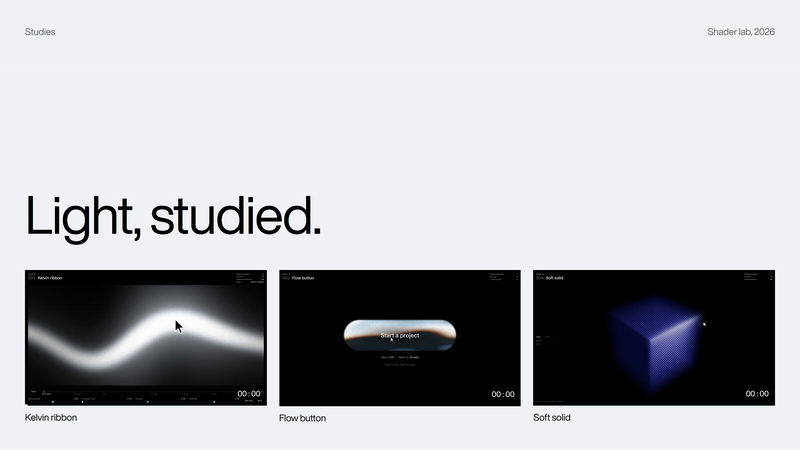

# Hover play



A video card holds its poster until you point at it, then plays; leave and it pauses on the frame it reached, with a hairline along the bottom showing where the loop is. Keyboard focus plays it too, and on touch screens it plays while it's mostly in view. Costs nothing while paused.

## With Claude Code

```
/animations:hover-play the project grid: each card's walkthrough clip
```

The skill is [`skills/hover-play.md`](../../skills/hover-play.md). It checks your project first, writes these files where your project keeps components, uses the component where you ask, and runs its own checks.

## Without it

| File | Where it goes |
|---|---|
| `HoverVideo.tsx` | `components/ui/` (or `src/components/ui/`) |

Needs: Nothing.

The skill file explains the rest: the props, the values and why they were chosen, and the ways it breaks.

## Tested

`hoverplay_extra.py` in [`tests/`](../../tests/), on three fresh projects (App Router with Tailwind v4 and v3, Pages Router without Tailwind), in dev and production, in Chromium, Firefox and WebKit.
