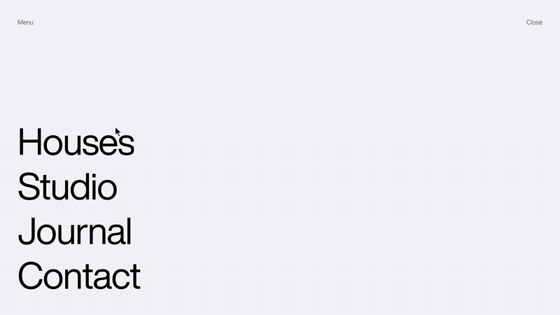

# Roll link hover



On hover a link's letters roll up one line in a 15 ms left-to-right wave while a dimmer copy rises from below. Pure CSS, server-rendered text, one accessible name, any length.

## With Claude Code

```
/animations:roll-link-hover the header links
```

The skill is [`skills/roll-link-hover.md`](../../skills/roll-link-hover.md). It checks your project first, writes these files where your project keeps components, uses the component where you ask, and runs its own checks.

## Without it

| File | Where it goes |
|---|---|
| `RollLink.tsx` | `components/ui/` (or `src/components/ui/`) |
| `RollLink.css` | `components/ui/` (or `src/components/ui/`); in the Pages Router, import it in `pages/_app.tsx` |

Needs: Nothing.

The skill file explains the rest: the props, the values and why they were chosen, and the ways it breaks.

## Tested

`harness.py roll tuned`, `roll_extra.py` in [`tests/`](../../tests/), on three fresh projects (App Router with Tailwind v4 and v3, Pages Router without Tailwind), in dev and production, in Chromium, Firefox and WebKit.
