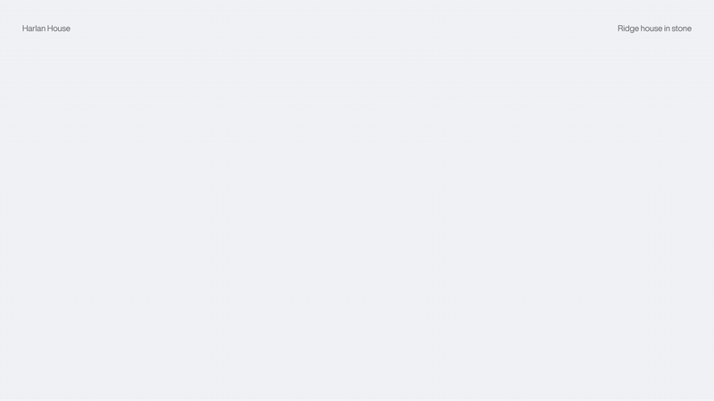

# Split text line reveal



Each line of a heading or paragraph rises out of its own mask, staggered, with GSAP's SplitText. It works in Server Components, starts from the very bottom of its rise even on a busy page, and hands the text back to React when it lands, so links and updates inside keep working.

## With Claude Code

```
/animations:split-text-line-reveal the hero heading on app/page.tsx
```

The skill is [`skills/split-text-line-reveal.md`](../../skills/split-text-line-reveal.md). It checks your project first, writes these files where your project keeps components, uses the component where you ask, and runs its own checks.

## Without it

| File | Where it goes |
|---|---|
| `SplitReveal.tsx` | `components/ui/` (or `src/components/ui/`) |
| `globals.css` | appended to your global stylesheet |
| `layout-head.tsx` | inside `<head>` in the root layout (`pages/_document.tsx` in the Pages Router) |

Needs: `gsap` 3.13 or later and `@gsap/react`.

The skill file explains the rest: the props, the values and why they were chosen, and the ways it breaks.

## Tested

`harness.py split tuned`, `split_react.py`, `split_start.py`, `split_dynamic.py`, `split_edge.py`, `mask_check.py` in [`tests/`](../../tests/), on three fresh projects (App Router with Tailwind v4 and v3, Pages Router without Tailwind), in dev and production, in Chromium, Firefox and WebKit.
